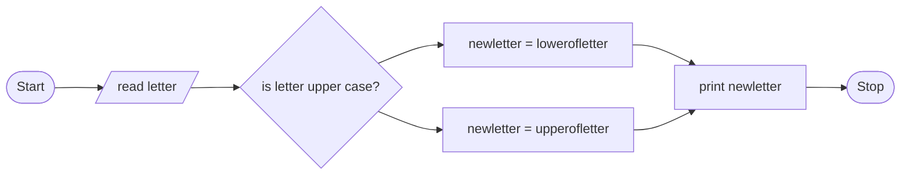

ALGORITHM(FLOWCHART)

```mermaid
graph LR;
id1([Start])-->id2[/read letter/]
id2--> id3{is letter upper case?}
id3--> id4[newletter = lowerofletter]
id3--> id5[newletter = upperofletter]
id4--> id6[print newletter]
id5--> id6[print newletter]
id6--> id7([Stop])
```
